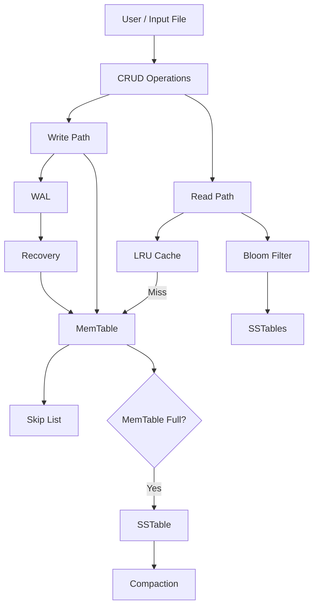
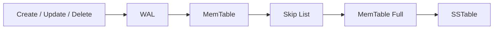
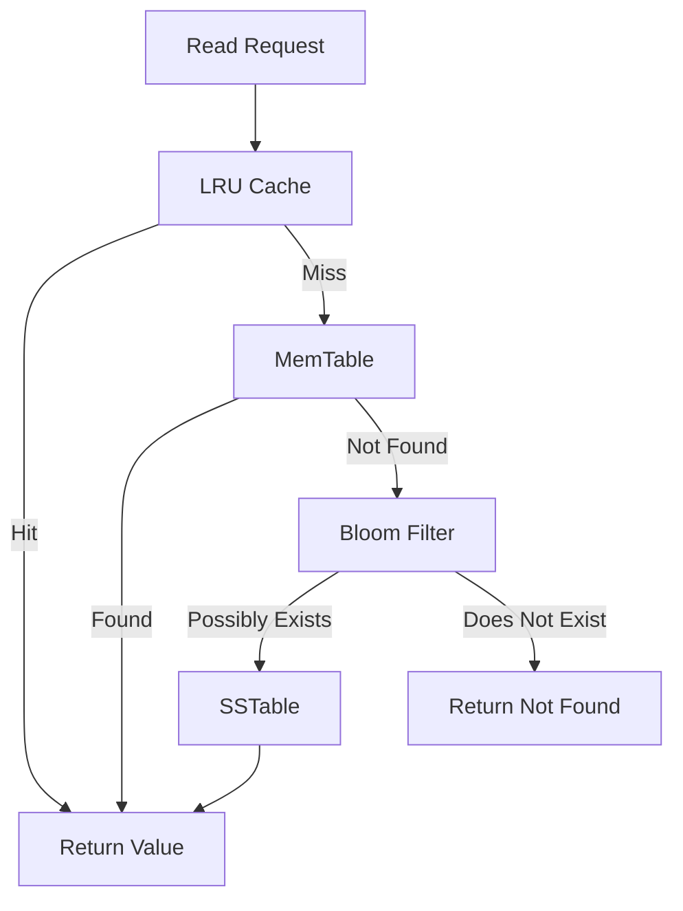
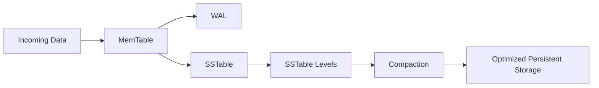

# Advanced Algorithms

University project developed as part of the Advanced Algorithms course, focused on implementing data structures, algorithms and a simplified storage engine in Go.

The project combines an LSM-based key-value storage system with multiple data structures and algorithms for efficient data storage, retrieval, caching, rate limiting, data integrity and approximate data processing.

## About the Project

The main part of the project is a key-value storage engine based on the LSM (Log-Structured Merge-Tree) architecture.

Incoming data is first stored in memory inside a MemTable implemented using a Skip List. Every write operation is also recorded in a Write-Ahead Log (WAL), allowing the application to recover data after a restart. When the MemTable reaches its limit, its contents are written to SSTables on disk. SSTables can later be compacted to reduce the number of files and remove obsolete data.

The read path combines the in-memory data, persistent SSTables, Bloom Filters and an LRU cache to efficiently locate requested values.

The project also includes independent implementations of several advanced data structures and algorithms such as Bloom Filter, Count-Min Sketch, HyperLogLog, Merkle Tree and SimHash.

## System Architecture



## Write Path

Write operations follow a write-ahead approach to ensure that data can be recovered after a failure.



The WAL records changes before they are persisted into SSTables. During application startup, existing WAL segments are scanned and their operations are replayed into the MemTable.

## Read Path

Read operations first check the fastest available data sources before searching persistent storage.



The LRU cache stores frequently accessed values, while the Bloom Filter helps avoid unnecessary SSTable lookups when a key is definitely not present.

## Storage Lifecycle



This architecture separates fast in-memory operations from persistent disk storage while providing recovery and background-style storage organization through SSTables and compaction.

## Main Features

### Storage Engine

* Key-value storage
* Create, Read, Update and Delete operations
* MemTable
* Skip List
* Write-Ahead Log
* SSTables
* LSM-style storage
* SSTable compaction
* WAL-based recovery
* Separate read and write paths

### Performance and Reliability

* LRU cache for frequently accessed values
* Bloom Filter for efficient membership checks
* Token Bucket rate limiting
* Memory-mapped file operations
* Persistent storage and recovery

## My Contribution

I was responsible for the implementation and integration of the core storage-engine components and the main application flow.

My work included:

* Implementing and integrating the CRUD functionality
* Working on the MemTable and Skip List
* Implementing the write path and WAL interaction
* Implementing the read path
* Working with SSTable-based persistent storage
* Implementing storage initialization and WAL recovery
* Integrating the LRU cache
* Integrating the Token Bucket rate-limiting mechanism
* Connecting the individual components through the main application
* Working on file-based input and command processing
* Testing the interaction between the different storage components

The main application initializes the storage system, creates the MemTable, cache and Token Bucket, scans the WAL for recovery and provides the command-line interface for CRUD operations and SSTable compaction.

## Technology

* Go

## Running the Project

### Prerequisites

* Go

### Clone the repository

```bash
git clone https://github.com/sakii10/Advanced-Algorithms.git
cd Advanced-Algorithms
```

### Run the application

```bash
go run main.go
```

The application provides a command-line interface for executing CRUD operations, processing commands from an input file and triggering SSTable compaction.

Input files use the following format:

```text
COMMAND|KEY|VALUE
```

Example:

```text
c|Papaya|Orange
r|Papaya|/
u|Papaya|Apple
d|Papaya|/
```
